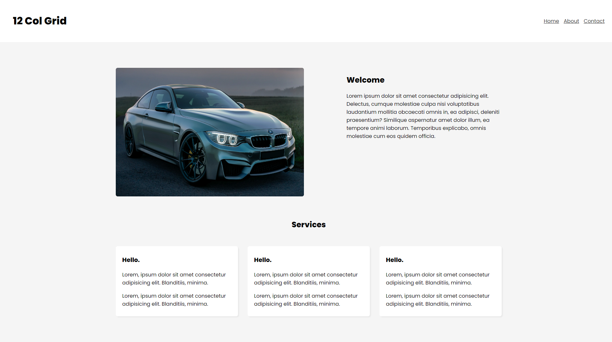
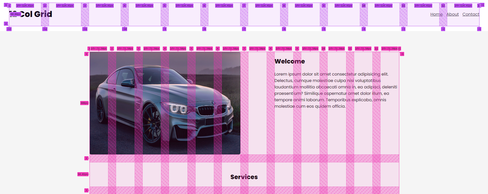
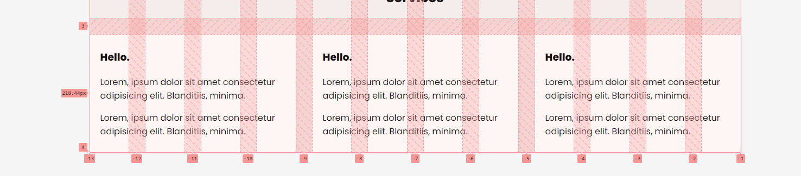
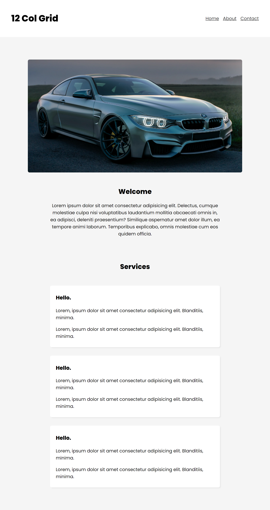

# Twelve Column Layout with Grid

## The End Design


```
@import url('https://fonts.googleapis.com/css2?family=Poppins:wght@200;400;500;600;800&family=VT323&display=swap');
body {
  margin: 0;
  font-family: "Poppins";
  background: #f5f5f5;
}
main {
  max-width: 1200px;
  margin: 60px auto;
  padding: 20px;
}
```



In this layout we are going to have two grids, Header and Main.

Each Grid will have 12 columns in it with 30px gap.

```
header {
  padding: 20px 40px;
  background: #fff;
```

In the Header, h1 and Nav each will span 6 columns but nav will be placed at the end of the column.


```
header nav a {
  color: #333;
  margin-left: 10px;
}
```

The image will span 6 column
```
main img {
  border-radius: 6px;
}
```

Welcome text will span 5 columns and there will be 1 empty column between the image and the welcome text block

Services h2 tag will span all 12 columns

```
main > h2 {
  font-size: 1.5em;
  padding-top: 20px;
}
```



Cards will span 4 columns

```
main .card {
  background: #fff;
  padding: 10px 20px;
  border-radius: 6px;
  box-shadow: 3px 3px 3px rgba(0,0,0,0.05);
}

```

## Responsive Design

At 960px width wide  let's arrange the columns so design lookks like as follows.

The main image will span 10 columns, leaving first and last column empty.

Welcome block and Cards will span 8 columns leaving first and last 2 columns empty.

